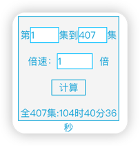

1. 课程视频地址：
   https://www.bilibili.com/video/BV1np4y1C7Yf?p=1

1. 视频总时长：
   (获取方法见:https://juejin.cn/post/7158087377104142372)
   

1. 用此代码获取分集标题：
   `
   var box=document.getElementsByClassName('list-box')[0];
   var boxtext=box.innerText;
   var textline=boxtext.replace(/\n(?!P\d+)/g,' ');
   console.log(textline);
   `
   https://www.bilibili.com/video/BV1np4y1C7Yf?p

1. 目录
     P1 01、简介-项目介绍 11:30
     P2 02、简介-项目整体效果展示 10:40
     P3 03、简介-分布式基础概念 17:32
     P4 04、简介-项目微服务架构图 08:00
     P5 05、简介-项目微服务划分图 05:13
     P6 06、环境-使用vagrant快速创建linux虚拟机 10:18
     P7 07、环境-虚拟机网络设置 05:29
     P8 08、环境-linux安装docker 08:11
     P9 09、环境-配置docker阿里云镜像加速 02:07
     P10 10、环境-docker安装mysql 15:40
     P11 11、环境-docker安装redis 09:28
     P12 12、环境-开发工具&环境安装配置 06:59
     P13 13、环境-配置git-ssh 04:30
     P14 14、环境-项目结构创建&提交到码云 12:12
     P15 15、环境-数据库初始化 08:48
     P16 16、快速开发-人人开源搭建后台管理系统 14:11
     P17 17、快速开发-逆向工程搭建&使用 21:17
     P18 18、快速开发-配置&测试微服务基本CRUD功能 16:19
     P19 19、快速开发-逆向生成所有微服务基本CRUD代码 16:10
     P20 20、分布式组件-SpringCloud Alibaba简介 10:45
     P21 21、分布式组件-SpringCloud Alibaba-Nacos注册中心 09:20
     P22 22、分布式组件-SpringCloud-OpenFeign测试远程调用 14:29
     P23 23、分布式组件-SpringCloud Alibaba-Nacos配置中心-简单示例 15:08
     P24 24、分布式组件-SpringCloud Alibaba-Nacos配置中心-命名空间与配置分组 16:50
     P25 25、分布式组件-SpringCloud Alibaba-Nacos配置中心-加载多配置集 10:54
     P26 26、分布式组件-SpringCloud-Gateway网关核心概念&原理 14:01
     P27 27、分布式组件-SpringCloud-Gateway-创建&测试API网关 12:23
     P28 28、前端基础-技术栈简介 03:36
     P29 29、前端基础-ES6-let&const 05:21
     P30 30、前端基础-ES6-解构&字符串 08:16
     P31 31、前端基础-ES6-箭头函数 07:21
     P32 32、前端基础-ES6-对象优化 09:59
     P33 33、前端基础-ES6-map、reduce 05:16
     P34 34、前端基础-ES6-promise异步编排 18:01
     P35 35、前端基础-ES6-模块化 06:09
     P36 36、前端基础-Vue-介绍&HelloWorld 09:13
     P37 37、前端基础-Vue-基本语法&插件安装 09:29
     P38 38、前端基础-Vue-指令-单向绑定&双向绑定 18:05
     P39 39、前端基础-Vue-指令-v-on、v-for、v-if 16:54
     P40 40、前端基础-Vue-计算属性和侦听器 10:32
     P41 41、前端基础-Vue-组件化基础 07:27
     P42 42、前端基础-Vue-生命周期和钩子函数 07:06
     P43 43、前端基础-Vue-使用Vue脚手架进行模块化开发 18:24
     P44 44、前端基础-Vue-整合ElementUI快速开发 15:53
     P45 45、商品服务-API-三级分类-查询-递归树形结构数据获取 20:03
     P46 46、商品服务-API-三级分类-配置网关路由与路径重写 24:02
     P47 47、商品服务-API-三级分类-网关统一配置跨域 16:53
     P48 48、商品服务-API-三级分类-查询-树形展示三级分类数据 13:28
     P49 49、商品服务-API-三级分类-删除-页面效果 09:45
     P50 50、商品服务-API-三级分类-删除-逻辑删除 13:19
     P51 51、商品服务-API-三级分类-删除-删除效果细化 18:23
     P52 52、商品服务-API-三级分类-新增-新增效果完成 15:24
     P53 53、商品服务-API-三级分类-修改-基本修改效果完成 26:56
     P54 54、商品服务-API-三级分类-修改-拖拽效果 16:58
     P55 55、商品服务-API-三级分类-修改-拖拽数据收集 33:56
     P56 56、商品服务-API-三级分类-修改-拖拽功能完成 13:15
     P57 57、商品服务-API-三级分类-修改-批量拖拽效果 11:21
     P58 58、商品服务-API-三级分类-删除-批量删除&小结 13:47
     P59 59、商品服务-API-品牌管理-使用逆向工程的前后端代码 06:23
     P60 60、商品服务-API-品牌管理-效果优化与快速显示开关 17:31
     P61 61、商品服务-API-品牌管理-云存储开通与使用 13:17
     P62 62、商品服务-API-品牌管理-OSS整合测试 12:57
     P63 63、商品服务-API-品牌管理-OSS获取服务端签名 22:14
     P64 64、商品服务-API-品牌管理-OSS前后联调测试上传 14:27
     P65 65、商品服务-API-品牌管理-表单校验&自定义校验器 18:48
     P66 66、商品服务-API-品牌管理-JSR303数据校验 16:52
     P67 67、商品服务-API-品牌管理-统一异常处理 14:17
     P68 68、商品服务-API-品牌管理-JSR303分组校验 11:57
     P69 69、商品服务-API-品牌管理-JSR303自定义校验注解 19:38
     P70 70、商品服务-概念-SPU&SKU&规格参数&销售属性 17:42
     P71 71、商品服务-API-属性分组-前端组件抽取&父子组件交互 24:47
     P72 72、商品服务-API-属性分组-获取分类属性分组 16:43
     P73 73、商品服务-API-属性分组-分组新增&级联选择器 12:37
     P74 74、商品服务-API-属性分组-分组修改&级联选择器回显 17:57
     P75 75、商品服务-API-品牌管理-品牌分类关联与级联更新 27:05
     P76 76、商品服务-API-平台属性-规格参数新增与VO 14:41
     P77 77、商品服务-API-平台属性-规格参数列表 12:59
     P78 78、商品服务-API-平台属性-规格修改 12:16
     P79 79、商品服务-API-平台属性-销售属性维护 12:17
     P80 80、商品服务-API-平台属性-查询分组关联属性&删除关联 14:27
     P81 81、商品服务-API-平台属性-查询分组未关联的属性 17:06
     P82 82、商品服务-API-平台属性-新增分组与属性关联 07:29
     P83 83、商品服务-API-新增商品-调试会员等级相关接口 12:26
     P84 84、商品服务-API-新增商品-获取分类关联的品牌 11:06
     P85 85、商品服务-API-新增商品-获取分类下所有分组以及属性 12:28
     P86 86、商品服务-API-新增商品-商品新增vo抽取 20:35
     P87 87、商品服务-API-新增商品-商品新增业务流程分析 11:26
     P88 88、商品服务-API-新增商品-保存SPU基本信息 13:45
     P89 89、商品服务-API-新增商品-保存SKU基本信息 11:04
     P90 90、商品服务-API-新增商品-调用远程服务保存优惠等信息 27:43
     P91 91、商品服务-API-新增商品-商品保存debug完成 14:31
     P92 92、商品服务-API-新增商品-商品保存其他问题处理 07:48
     P93 93、商品服务-API-商品管理-SPU检索 10:44
     P94 94、商品服务-API-商品管理-SKU检索 11:15
     P95 95、仓储服务-API-仓库管理-整合ware服务&获取仓库列表 08:25
     P96 96、仓储服务-API-仓库管理-查询库存&创建采购需求 10:18
     P97 97、仓储服务-API-仓库管理-合并采购需求 20:08
     P98 98、仓储服务-API-仓库管理-领取采购单 14:20
     P99 99、仓储服务-API-仓库管理-完成采购 33:29
     P100 100、商品服务-API-商品管理-SPU规格维护 10:55
     P101 101、分布式基础篇总结 11:11
     P102 102、全文检索-ElasticSearch-简介 14:59
     P103 103、全文检索-ElasticSearch-Docker安装ES 12:50
     P104 104、全文检索-ElasticSearch-Docker安装Kibana 05:56
     P105 105、全文检索-ElasticSearch-入门-_cat 03:09
     P106 106、全文检索-ElasticSearch-入门-put&post新增数据 05:57
     P107 107、全文检索-ElasticSearch-入门-get查询数据&乐观锁字段 06:37
     P108 108、全文检索-ElasticSearch-入门-put&post修改数据 06:18
     P109 109、全文检索-ElasticSearch-入门-删除数据&bulk批量操作导入样本测试数据 12:15
     P110 110、全文检索-ElasticSearch-进阶-两种查询方式 10:53
     P111 111、全文检索-ElasticSearch-进阶-QueryDSL基本使用&match_all 06:29
     P112 112、全文检索-ElasticSearch-进阶-match全文检索 04:47
     P113 113、全文检索-ElasticSearch-进阶-match_phrase短语匹配 01:58
     P114 114、全文检索-ElasticSearch-进阶-multi_match多字段匹配 02:29
     P115 115、全文检索-ElasticSearch-进阶-bool复合查询 06:11
     P116 116、全文检索-ElasticSearch-进阶-filter过滤 04:30
     P117 117、全文检索-ElasticSearch-进阶-term查询 06:04
     P118 118、全文检索-ElasticSearch-进阶-aggregations聚合分析 18:54
     P119 119、全文检索-ElasticSearch-映射-mapping创建 10:15
     P120 120、全文检索-ElasticSearch-映射-添加新的字段映射 03:03
     P121 121、全文检索-ElasticSearch-映射-修改映射&数据迁移 09:05
     P122 122、全文检索-ElasticSearch-分词-分词&安装ik分词 16:53
     P123 123、补充-修改linux网络设置&开启root密码访问 06:02
     P124 124、全文检索-ElasticSearch-分词-自定义扩展词库 14:46
     P125 125、全文检索-ElasticSearch-整合-SpringBoot整合high-level-client 19:48
     P126 126、全文检索-ElasticSearch-整合-测试保存 13:03
     P127 127、全文检索-ElasticSearch-整合-测试复杂检索 33:23
     P128 128、商城业务-商品上架-sku在es中存储模型分析 21:44
     P129 129、商城业务-商品上架-nested数据类型场景 05:14
     P130 130、商城业务-商品上架-构造基本数据 20:28
     P131 131、商城业务-商品上架-构造sku检索属性 11:17
     P132 132、商城业务-商品上架-远程查询库存&泛型结果封装 21:18
     P133 133、商城业务-商品上架-远程上架接口 21:34
     P134 134、商城业务-商品上架-上架接口调试&feign源码 23:15
     P135 135、商城业务-商品上架-抽取响应结果&上架测试完成 19:42
     P136 136、商城业务-首页-整合thymeleaf渲染首页 16:22
     P137 137、商城业务-首页-整合dev-tools渲染一级分类数据 17:20
     P138 138、商城业务-首页-渲染二级三级分类数据 25:01
     P139 139、商城业务-nginx-搭建域名访问环境一（反向代理配置） 24:52
     P140 140、商城业务-nginx-搭建域名访问环境二（负载均衡到网关） 18:11
     P141 141、性能压测-压力测试-基本介绍 09:06
     P142 142、性能压测-压力测试-Apache JMeter安装使用 18:08
     P143 143、性能压测-压力测试-JMeter在windows下地址占用bug解决 07:25
     P144 144、性能压测-性能监控-堆内存与垃圾回收 18:00
     P145 145、性能压测-性能监控-jvisualvm使用 11:27
     P146 146、性能压测-优化-中间件对性能的影响 19:57
     P147 147、性能压测-优化-简单优化吞吐量测试 23:24
     P148 148、性能压测-优化-nginx动静分离 13:23
     P149 149、性能压测-优化-模拟线上应用内存崩溃宕机情况 09:05
     P150 150、性能压测-优化-优化三级分类数据获取 07:20
     P151 151、缓存-缓存使用-本地缓存与分布式缓存 15:37
     P152 152、缓存-缓存使用-整合redis测试 08:45
     P153 153、缓存-缓存使用-改造三级分类业务 10:13
     P154 154、缓存-缓存使用-压力测试出的内存泄露及解决 15:59
     P155 155、缓存-缓存使用-缓存击穿、穿透、雪崩 11:27
     P156 156、缓存-缓存使用-加锁解决缓存击穿问题 18:55
     P157 157、缓存-缓存使用-本地锁在分布式下的问题 03:58
     P158 158、缓存-分布式锁-分布式锁原理与使用 40:45
     P159 159、缓存-分布式锁-Redisson简介&整合 13:32
     P160 160、缓存-分布式锁-Redisson-lock锁测试 16:22
     P161 161、缓存-分布式锁-Redisson-lock看门狗原理-redisson如何解决死锁 17:06
     P162 162、缓存-分布式锁-Redisson-读写锁测试 11:05
     P163 163、缓存-分布式锁-Redisson-读写锁补充 05:30
     P164 164、缓存-分布式锁-Redisson-闭锁测试 07:18
     P165 165、缓存-分布式锁-Redisson-信号量测试 07:17
     P166 166、缓存-分布式锁-缓存一致性解决 28:00
     P167 167、缓存-SpringCache-简介 11:28
     P168 168、缓存-SpringCache-整合&体验@Cacheable 15:07
     P169 169、缓存-SpringCache-@Cacheable细节设置 10:44
     P170 170、缓存-SpringCache-自定义缓存配置 23:23
     P171 171、缓存-SpringCache-@CacheEvict 15:48
     P172 172、缓存-SpringCache-原理与不足 19:27
     P173 173、商城业务-检索服务-搭建页面环境 11:40
     P174 174、商城业务-检索服务-调整页面跳转 09:00
     P175 175、商城业务-检索服务-检索查询参数模型分析抽取 20:06
     P176 176、商城业务-检索服务-检索返回结果模型分析抽取 12:13
     P177 177、商城业务-检索服务-检索DSL测试-查询部分 24:07
     P178 178、商城业务-检索服务-检索DSL测试-聚合部分 22:50
     P179 179、商城业务-检索服务-SearchRequest构建-检索 30:51
     P180 180、商城业务-检索服务-SearchRequest构建-排序、分页、高亮&测试 18:44
     P181 181、商城业务-检索服务-SearchRequest构建-聚合 16:47
     P182 182、商城业务-检索服务-SearchResponse分析&封装 34:23
     P183 183、商城业务-检索服务-验证结果封装正确性 14:18
     P184 184、商城业务-检索服务-页面基本数据渲染 20:57
     P185 185、商城业务-检索服务-页面筛选条件渲染 14:12
     P186 186、商城业务-检索服务-页面分页数据渲染 21:49
     P187 187、商城业务-检索服务-页面排序功能 22:29
     P188 188、商城业务-检索服务-页面排序字段回显 21:24
     P189 189、商城业务-检索服务-页面价格区间搜索 22:04
     P190 190、商城业务-检索服务-面包屑导航 16:49
     P191 191、商城业务-检索服务-条件删除与URL编码问题 18:27
     P192 192、商城业务-检索服务-条件筛选联动 24:45
     P193 193、商城业务-异步-异步复习 17:44
     P194 194、商城业务-异步-线程池详解 24:54
     P195 195、商城业务-异步-CompletableFuture 09:39
     P196 196、商城业务-异步-CompletableFuture-启动异步任务 06:09
     P197 197、商城业务-异步-CompletableFuture-完成回调与异常感知 05:36
     P198 198、商城业务-异步-CompletableFuture-handle最终处理 03:48
     P199 199、商城业务-异步-CompletableFuture-线程串行化 09:26
     P200 200、商城业务-异步-CompletableFuture-两任务组合-都要完成 09:42
     P201 201、商城业务-异步-CompletableFuture-两任务组合-一个完成 09:04
     P202 202、商城业务-异步-CompletableFuture-多任务组合 08:50
     P203 203、商城业务-商品详情-环境搭建 10:48
     P204 204、商城业务-商品详情-模型抽取 11:59
     P205 205、商城业务-商品详情-规格参数 27:47
     P206 206、商城业务-商品详情-销售属性组合 12:30
     P207 207、商城业务-商品详情-详情页渲染 24:46
     P208 208、商城业务-商品详情-销售属性渲染 31:51
     P209 209、商城业务-商品详情-sku组合切换 15:24
     P210 210、商城业务-商品详情-异步编排优化 14:44
     P211 211、商城业务-认证服务-环境搭建 12:15
     P212 212、商城业务-认证服务-好玩的验证码倒计时 25:45
     P213 213、商城业务-认证服务-整合短信验证码 22:55
     P214 214、商城业务-认证服务-验证码防刷校验 28:35
     P215 215、商城业务-认证服务-一步一坑的注册页环境 34:29
     P216 216、商城业务-认证服务-异常机制 23:30
     P217 217、商城业务-认证服务-MD5&盐值&BCrypt 19:15
     P218 218、商城业务-认证服务-注册完成 18:33
     P219 219、商城业务-认证服务-账号密码登录完成 23:30
     P220 220、商城业务-认证服务-OAuth2.0简介 12:10
     P221 221、商城业务-认证服务-weibo登录测试 24:47
     P222 222、商城业务-认证服务-社交登录回调 15:51
     P223 223、商城业务-认证服务-社交登录完成 30:45
     P224 224、商城业务-认证服务-社交登录测试成功 15:04
     P225 225、商城业务-认证服务-分布式session不共享不同步问题 13:27
     P226 226、商城业务-认证服务-分布式session解决方案原理 20:22
     P227 227、商城业务-认证服务-SpringSession整合 18:35
     P228 228、商城业务-认证服务-自定义SpringSession完成子域session共享 14:45
     P229 229、商城业务-认证服务-SpringSession原理 16:53
     P230 230、商城业务-认证服务-页面效果完成 20:34
     P231 231、商城业务-认证服务-单点登录简介 07:02
     P232 232、商城业务-认证服务-补-框架效果演示 18:22
     P233 233、商城业务-认证服务-单点登录流程-1 31:41
     P234 234、商城业务-认证服务-单点登录流程-2 23:02
     P235 235、商城业务-认证服务-单点登录流程-3 37:28
     P236 236、商城业务-购物车-环境搭建 12:23
     P237 237、商城业务-购物车-数据模型分析 22:27
     P238 238、商城业务-购物车-VO编写 12:09
     P239 239、商城业务-购物车-ThreadLocal用户身份鉴别 37:54
     P240 240、商城业务-购物车-页面环境搭建 08:35
     P241 241、商城业务-购物车-添加购物车 41:38
     P242 242、商城业务-购物车-添加购物车细节 06:04
     P243 243、商城业务-购物车-RedirectAttribute 14:10
     P244 244、商城业务-购物车-获取&合并购物车 31:36
     P245 245、商城业务-购物车-选中购物项 09:17
     P246 246、商城业务-购物车-改变购物项数量 09:22
     P247 247、商城业务-购物车-删除购物项 05:27
     P248 247、商城业务-消息队列-MQ简介 09:56
     P249 248、商城业务-消息队列-RabbitMQ简介 15:23
     P250 249、商城业务-消息队列-RabbitMQ工作流程 19:19
     P251 250、商城业务-消息队列-RabbitMQ安装 10:50
     P252 251、商城业务-消息队列-Exchange类型 16:11
     P253 252、商城业务-消息队列-Direct-Exchange 08:01
     P254 253、商城业务-消息队列-Fanout-Exchange 02:43
     P255 254、商城业务-消息队列-Topic-Exchange 04:13
     P256 255、商城业务-消息队列-SpringBoot整合RabbitMQ 08:31
     P257 256、商城业务-消息队列-AmqpAdmin使用 14:42
     P258 257、商城业务-消息队列-RabbitTemplate使用 11:12
     P259 258、商城业务-消息队列-RabbitListener&RabbitHandler接收消息 28:09
     P260 259、商城业务-消息队列-可靠投递-发送端确认 32:52
     P261 260、商城业务-消息队列-可靠投递-消费端确认 30:19
     P262 261、商城业务-订单服务-页面环境搭建 17:25
     P263 262、商城业务-订单服务-整合SpringSession 12:51
     P264 263、商城业务-订单服务-订单基本概念 10:52
     P265 264、商城业务-订单服务-订单登录拦截 11:25
     P266 265、商城业务-订单服务-订单确认页模型抽取 10:45
     P267 266、商城业务-订单服务-订单确认页数据获取 19:56
     P268 267、商城业务-订单服务-Feign远程调用丢失请求头问题 27:35
     P269 268、商城业务-订单服务-Feign异步调用丢失请求头问题 18:40
     P270 269、商城业务-订单服务-bug修改 04:43
     P271 270、商城业务-订单服务-订单确认页渲染 16:28
     P272 271、商城业务-订单服务-订单确认页库存查询 13:26
     P273 272、商城业务-订单服务-订单确认页模拟运费效果 26:18
     P274 273、商城业务-订单服务-订单确认页细节显示 07:42
     P275 274、商城业务-订单服务-接口幂等性讨论 25:26
     P276 275、商城业务-订单服务-订单确认页完成 21:08
     P277 276、商城业务-订单服务-原子验令牌 12:41
     P278 277、商城业务-订单服务-构造订单数据 20:28
     P279 278、商城业务-订单服务-构造订单项数据 16:11
     P280 279、商城业务-订单服务-订单验价 23:32
     P281 280、商城业务-订单服务-保存订单数据 17:08
     P282 281、商城业务-订单服务-锁定库存 24:32
     P283 282、商城业务-订单服务-提交订单的问题 19:49
     P284 283、商城业务-分布式事务-本地事务在分布式下的问题 14:13
     P285 284、商城业务-分布式事务-本地事务隔离级别&传播行为等复习 18:39
     P286 285、商城业务-分布式事务-分布式CAP&Raft原理 37:01
     P287 286、商城业务-分布式事务-BASE 08:22
     P288 287、商城业务-分布式事务-分布式事务常见解决方案 11:47
     P289 288、商城业务-分布式事务-Seata&环境准备 15:06
     P290 289、商城业务-分布式事务-Seata分布式事务体验 25:53
     P291 290、商城业务-分布式事务-最终一致性库存解锁逻辑 11:11
     P292 291、商城业务-订单服务-RabbitMQ延时队列 18:20
     P293 292、商城业务-订单服务-延时队列定时关单模拟 29:26
     P294 293、商城业务-订单服务-创建业务交换机&队列 20:13
     P295 294、商城业务-订单服务-监听库存解锁 32:20
     P296 295、商城业务-订单服务-库存解锁逻辑 21:16
     P297 296、商城业务-订单服务-库存自动解锁完成 11:14
     P298 297、商城业务-订单服务-测试库存自动解锁 09:05
     P299 298、商城业务-订单服务-定时关单完成 40:37
     P300 299、商城业务-订单服务-消息丢失、积压、重复等解决方案 22:50
     P301 300、商城业务-支付-支付宝沙箱&代码 09:10
     P302 301、商城业务-支付-RSA、加密加签、密钥等 25:17
     P303 302、商城业务-支付-内网穿透 18:04
     P304 303、商城业务-订单服务-整合支付前需要注意的问题 00:40
     P305 304、商城业务-订单服务-整合支付 27:48
     P306 305、商城业务-订单服务-支付成功同步回调 17:52
     P307 306、商城业务-订单服务-订单列表页渲染完成 34:44
     P308 307、商城业务-订单服务-异步通知内网穿透环境搭建 24:11
     P309 308、商城业务-订单服务-支付完成 23:43
     P310 309、商城业务-订单服务-收单 11:04
     P311 310、商城业务-秒杀服务-后台添加秒杀商品 14:37
     P312 311、商城业务-秒杀服务-定时任务&Cron表达式 15:03
     P313 312、商城业务-秒杀服务-SpringBoot整合定时任务与异步任务 17:27
     P314 313、商城业务-秒杀服务-时间日期处理 20:49
     P315 314、商城业务-秒杀服务-秒杀商品上架-1 21:37
     P316 315、商城业务-秒杀服务-秒杀商品上架-2 15:29
     P317 316、商城业务-秒杀服务-秒杀商品上架-3 08:58
     P318 317、商城业务-秒杀服务-幂等性保证 17:05
     P319 318、商城业务-秒杀服务-查询秒杀商品 31:27
     P320 319、商城业务-秒杀服务-秒杀页面渲染 26:49
     P321 320、商城业务-秒杀服务-秒杀系统设计 18:36
     P322 321、商城业务-秒杀服务-登录检查 19:52
     P323 322、商城业务-秒杀服务-秒杀流程 24:39
     P324 323、商城业务-秒杀服务-秒杀效果完成 26:39
     P325 324、商城业务-秒杀服务-秒杀页面完成 14:23
     P326 325、Sentinel-高并发方法论&简介 20:29
     P327 326、Sentinel-基本概念 09:29
     P328 327、Sentinel-整合SpringBoot 13:49
     P329 328、Sentinel-自定义流控响应 08:46
     P330 329、Sentinel-全服务引入 06:51
     P331 330、Sentinel-流控模式&效果 06:42
     P332 331、Sentinel-熔断降级 22:26
     P333 332、Sentinel-自定义受保护资源 13:40
     P334 333、Sentinel-网关流控 14:07
     P335 334、Sentinel-定制网关流控返回 07:48
     P336 335、Sleuth-链路追踪-基本概念&整合 15:00
     P337 336、Sleuth-链路追踪-整合Zipkin效果 11:06
     P338 337、Sleuth-链路追踪-Zipkin界面分析 20:44
     P339 338、分布式高级篇总结 14:50
     P340 339、k8s-简介 20:25
     P341 340、k8s-架构原理&核心概念 27:23
     P342 341、k8s-集群搭建-环境准备 10:33
     P343 342、k8s-集群搭建-创建三个虚拟机 06:35
     P344 343、k8s-集群搭建-NAT网络和前置环境 13:57
     P345 344、k8s-集群搭建-安装Docker、kubelet、kubeadm、kubectl 08:15
     P346 345、k8s-集群搭建-集群安装完成 21:17
     P347 346、k8s-入门-基本操作体验 17:18
     P348 347、k8s-入门-yaml&基本使用 16:24
     P349 348、k8s-入门-Pod、Service等概念 08:51
     P350 349、k8s-入门-Ingress 16:38
     P351 350、kubesphere-安装-前置环境 18:04
     P352 351、kubesphere-安装-最小化安装完成 07:19
     P353 352、kubesphere-安装-定制化安装&界面介绍 20:50
     P354 353、kubesphere-进阶-建立多租户系统 28:34
     P355 354、kubesphere-进阶-创建WordPress应用-密钥 14:18
     P356 355、kubesphere-进阶-创建WordPress应用-创建容器 15:34
     P357 356、kubesphere-进阶-创建WordPress应用-外网访问 05:20
     P358 357、kubesphere-进阶-什么是DevOps 20:01
     P359 358、kubesphere-进阶-流水线-创建凭证 19:41
     P360 359、kubesphere-进阶-流水线-CICD完整体验 29:28
     P361 360、集群-集群常见的基本形式 10:35
     P362 361、集群-MySQL-常见集群形式 14:54
     P363 362、集群-MySQL-主从同步 21:27
     P364 363、集群-ShardingSphere-简介 04:23
     P365 364、集群-ShardingSphere-分库分表&读写分离配置 43:54
     P366 365、集群-Redis-Cluster基本原理 10:36
     P367 366、集群-Redis-Cluster集群搭建 15:36
     P368 367、集群-ElasticSearch-集群原理 17:26
     P369 368、集群-ElasticSearch-集群搭建 15:16
     P370 369、集群-RabbitMQ-镜像集群搭建 18:05
     P371 370、部署-如何在k8s上部署有状态应用 05:55
     P372 371、部署-k8s部署MySQL 26:19
     P373 372、部署-k8s部署Redis 04:45
     P374 373、部署-k8s部署ElasticSearch&Kibana 11:14
     P375 374、部署-k8s部署RabbitMQ 02:56
     P376 375、部署-k8s部署Nacos 08:36
     P377 376、部署-k8s部署Zipkin 02:56
     P378 377、部署-k8s部署Sentinel 03:38
     P379 378、部署-k8s部署应用的流程 11:07
     P380 379、部署-生产环境配置抽取 21:07
     P381 380、部署-创建微服务Dockerfile 22:12
     P382 381、部署-创建微服务k8s部署描述文件 20:15
     P383 382、部署-理解targetPort、Port、NodePort 08:19
     P384 383、流水线-第一步-gitee拉取代码 07:16
     P385 384、流水线-第一步-参数化构建&环境变量 14:45
     P386 385、流水线-第二步-Sonar代码质量分析 16:21
     P387 386、流水线-第二步-Sonar代码质量分析-调试完成 16:20
     P388 387、流水线-第三步-构建&推送镜像 13:31
     P389 388、流水线-第四步-流水线编写完成 24:35
     P390 389、部署-移植数据库 09:14
     P391 390、流水线-流水线细节优化&解决OOM 20:31
     P392 391、流水线-流水线部署所有微服务 07:44
     P393 392、部署-Docker镜像操作 12:48
     P394 393、部署-整合阿里云镜像仓库 10:29
     P395 394、部署-Jenkins修改阿里云镜像仓库 06:29
     P396 395、流水线-部署gateway 08:33
     P397 396、流水线-部署auth-server 03:03
     P398 397、流水线-部署cart 02:19
     P399 403、最终部署-商城系统上线 17:45
     P400 398、流水线-部署coupon 05:49
     P401 399、流水线-部署完成&bug修改 11:49
     P402 400、流水线-修改为公有仓库 01:30
     P403 401、最终部署-第一次部署前置nginx 09:01
     P404 402、最终部署-创建网关与应用路由 08:19
     P405 404、最终部署-部署vue项目 16:44
     P406 405、最终部署-测试滚动更新部署admin-vue-app 06:30
     P407 406、线上预警与监控 06:04
     P408 407、集群部署篇-总结 04:34