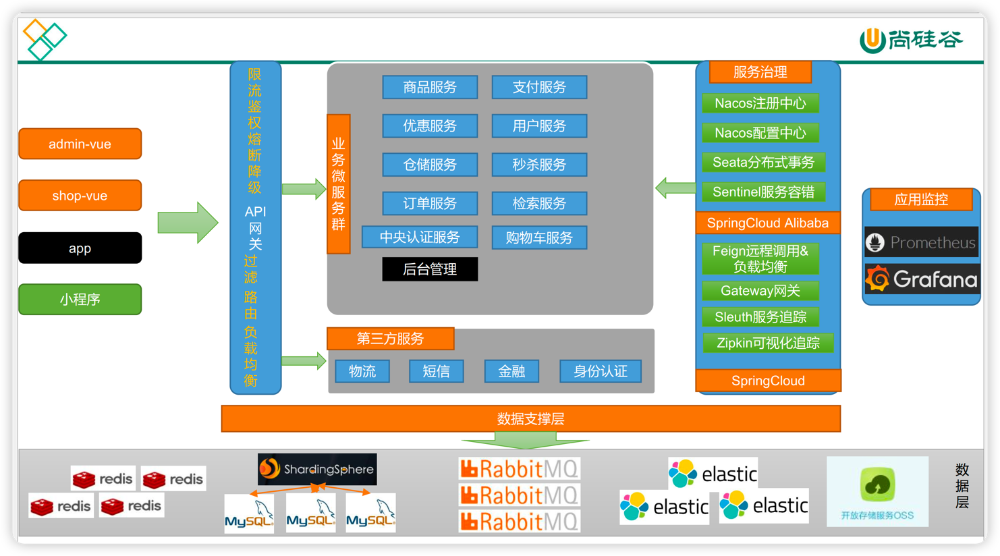

# 概要: 这是一个完全分布式的电商项目
1. 分布式基础篇
   1. 过程: ***快速开发一个后台管理系统***
      1. 数据库
         1. MySql
      1. 后端
           1. springboot
           1. MyBatis
           1. Spring cloud
           1. Docker
      1. 前端
         1. VUE
         1. ElementUI
   1. 目的:
      1. 使用逆向工程的方式,
      1. 即基于 DDL 建表语句
      1. 使用 RenRenGenerator开源工具,生成增删改查代码 
      1. <u>从而快速打通全栈开发能力</u>***
 
2. 分布式高级篇(微服务架构篇)
   1. 过程: ***实现一整套的 B2C 商城业务逻辑***
      1. 商品服务
      1. 购物车服务
      1. 订单服务
      1. 结算服务
      1. 库存服务
      1. 秒杀服务
      1. 等等 
   2. 目的 
      ***从而打通微服务开发的技术栈以及其中的重点难点, 从而拥有项目<u>技术架构</u>的能力, 包括下列技能***
      1. springboot
      1. spring cloud
         1. Ribbon (客户端负载均衡)
         1. feign (远程调用)
         1. spring cloud gateway (WebFlux网关)
         1. spring security (OAhth2.0 认证中心)
         1. 可视化全局链路追踪:
            1. Spring Cloud Sleuth  
            1. Spring Cloud Zipkin (可视化链路追踪)
            1. Metrics (监控)
      1. spring cloud alibaba
         1. Nacos(首先一方面作为注册中心提供服务注册和服务发现能力)
         1. Nacos(其次一方面作为配置中心提供动态配置,配置隔离,配置回滚能力)
         1. Sentinel(通过"熔断与降级"进行流量保护)
         1. seata(分布式事务)
      1. 可视化全局应用状态监控
         1. Prometheus (聚合分析)
         1. Grafana (可视化展示)
         1. Prometheus AlertManager (预警系统,以手机短息,或邮件的方式)
      1. 日志存储和检索开源技术栈
         1. ElasticSearch + LogStash + Kibana (即 ELK)
      1. 存储
         1. Redis 集群
         1. MySQL 主从分片
         1. ShardingSphere(将任何数据库转换成分布式数据库,<对数据库进行分库分表>)
         1. RabbitMQ 镜像集群队列
         1. ElasticSearch 全文检索
         1. 阿里云OSS对象存储 (存储视频,图片等静态文件)
      1. 任务调度
      1. 微服务开发期间的重点难点
         1. 分布式事务
         1. redis 分布式锁
         1. redis 分布式缓存
         1. Session 同步方案
         1. 全文检索
         1. 异步编排
         1. 线程池
         1. 压力测试
         1. 性能优化
         1. 监控, 限流, 网关, 熔断
 
3. 高可用集群篇 
   1. 过程: ***搭建一个 kubernetes 集群,使用 1 主 2 从的方式***
      1. CI流程
         1. Developer 写好代码,合并完冲突.
         1. 单元测是通过之后提交到 github dev 分支
         1. 触发 CI 流程(git clone, UT, SonarScan, SonarIQScan, CheckMarxScan).
         1. CI pipeline 通过后, manager review code, 然后合并到 master
         1. 合并到 mster 分支的操作会连续触发 CI pipeline 中的后续步骤(根据 Docker file 使用新代码创建新镜像,push 到 镜像仓库), 根据参数部署到测试及环境
         1. 一种测试环境测试完毕, 修改完 bug 之后,重复以上 2 步, 根据参数部署到下一种测试环境.
         1. 在发布新版本之前 code freeze,
         1. 循环以上 3 步, 在所有测试环境测试通过, 直至打完 release 包.
      1. CD流程
         1. 拉取 Docker 镜像
         1. 部署
   1. 目的: ***继续提高项目<u>架构能力</u>, 包含如下内容***
      1. 最终会使用 kubesphere 一站式平台, 快速将整个应用部署到 kubernetes 集群中. 
      1. 在Kubernetes 之上构建的面向云原生应用的分布式操作系统，完全开源，支持多云与多集群管理，提供全栈的IT 自动化运维能力，简化企业的DevOps 工作流.
      1. 从而打通整个 DevOps 技术栈
         1. 可视化的 CICD
         1. 参数化构建 + 手工确认 的 Pipeline 
         1. Docker
         1. kubesphere
         1. kubernetes
    
4. 谷粒商城-微服务架构图 
   

5. 谷粒商城-微服务划分图(业务架构图) 
   