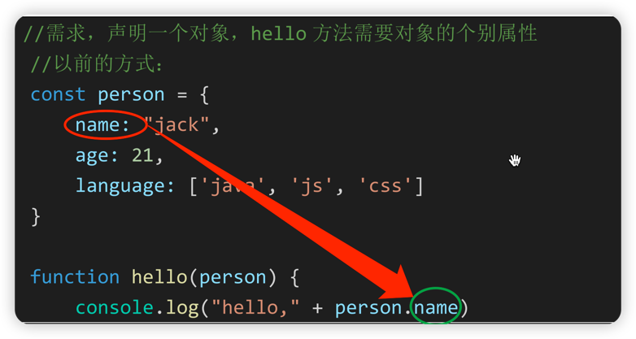
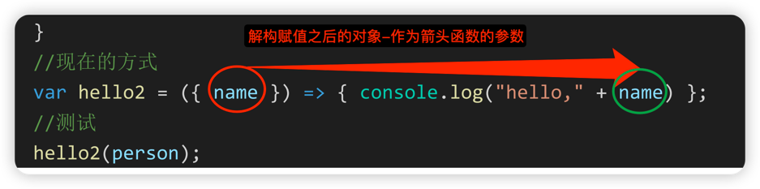
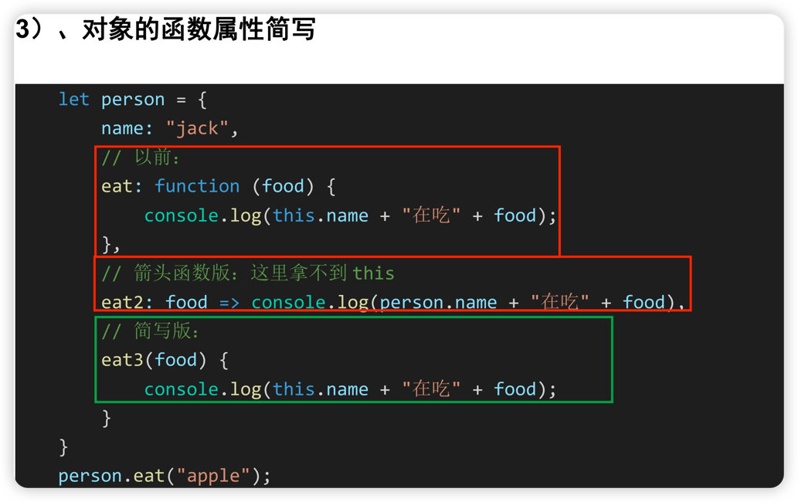
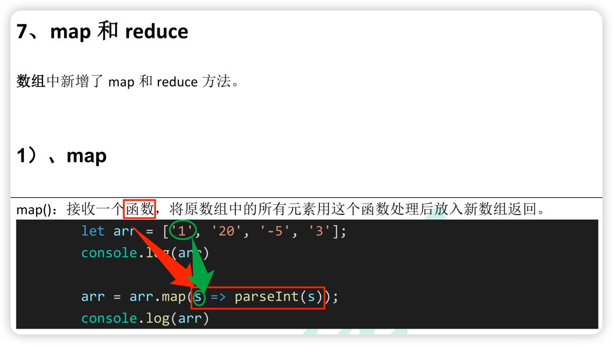
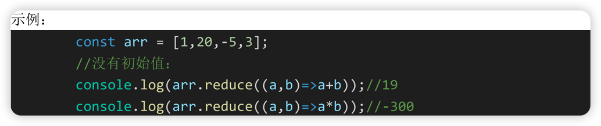
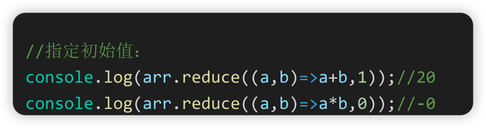
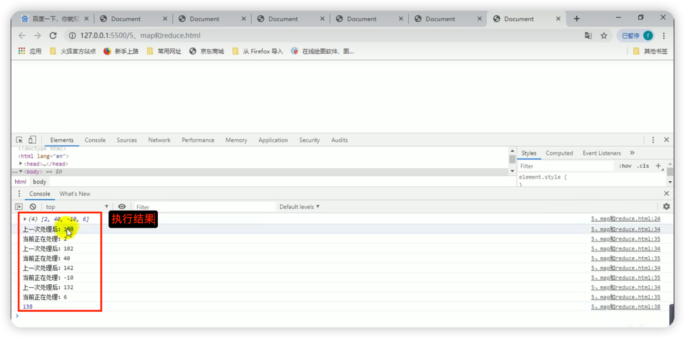

前端：
视频始于https://www.bilibili.com/video/BV1np4y1C7Yf/?p=28
视频配套课件：/Users/gcsp/Documents/BaiDuNetDisk/谷粒商城/课件和文档/基础篇/课件/03、前端开发基础知识.pdf
1. let, const
1. 解构赋值
1. String函数括展
   ES6 为字符串扩展了几个新的 API：
     - `includes()`： 返回布尔值， 表示是否找到了参数字符串。
     - `startsWith()`： 返回布尔值， 表示参数字符串是否在原字符串的头部。
     - `endsWith()`： 返回布尔值， 表示参数字符串是否在原字符串的尾部。
1. 字符串模板
1. 插值字符串
---
1. 函数参数默认值
1. 可变参数列表
1. 箭头函数
1. 解构赋值之后向箭头函数传参-新旧对比
    
    

---
1. 对象优化
    
---
1. map 和 reduce 之 map
   1) 、 map
   
1. map 和 reduce 之 reduce
   2） 、 reduce
   语法：
   arr.reduce(callback,[initialValue])
   reduce 为数组中的每一个元素依次执行回调函数， 不包括数组中被删除或从未被赋值的元
   素， 接受四个参数： 初始值（或者上一次回调函数的返回值） ， 当前元素值， 当前索引， 调
   用 reduce 的数组。
   callback （执行数组中每个值的函数， 包含四个参数）
   1、 previousValue （上一次调用回调返回的值， 或者是提供的初始值（initialValue） ）
   2、 currentValue （数组中当前被处理的元素）
   3、 index （当前元素在数组中的索引）
   4、 array （调用 reduce 的数组）
   initialValue （作为第一次调用 callback 的第一个参数。 ）
    
    
    
