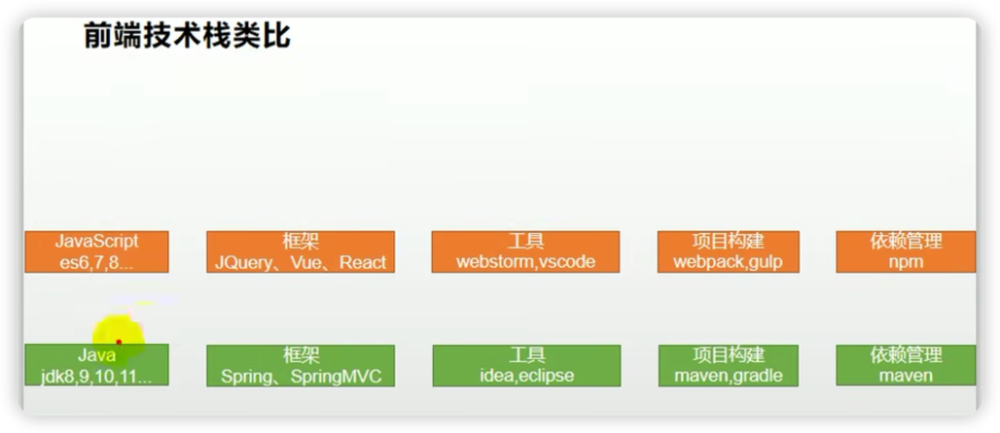

前端：
视频始于https://www.bilibili.com/video/BV1np4y1C7Yf/?p=28
视频配套课件：/Users/gcsp/Documents/BaiDuNetDisk/谷粒商城/课件和文档/基础篇/课件/03、前端开发基础知识.pdf
# 基础概念
1. Node.js:
    1. Node.js是一个基于Chrome V8引擎的JavaScript运行环境。
    1. Node.js使用了一个事件驱动的、非阻塞式I/O的模型，轻量又高效，它的底层是用C/C++编写的
1. NPM (Node Package Manager):
    1. NPM 是随同 Node.js一起安装的包管理工具.
    1. NPM 之于 javascript 相当于 maven 之于 java
    1. 最常用的命令:
        1. npm [run] install (大概相当于  maven package)
        1. npm [run] start
1. VUE 或 React (二者相当于 java 后端开发所用的 的 spring MVC)

1. Babel:
    1. Babel 是一个 Javascript 编译器,可以将 ES 最新语法编写的代码,编译为旧的浏览器所兼容的旧版本的 ES 的代码.
1. Webpack 或 Gulp (二者是自动化项目构建工具,相当与 java 的)
1. 前后端技术类比:
   