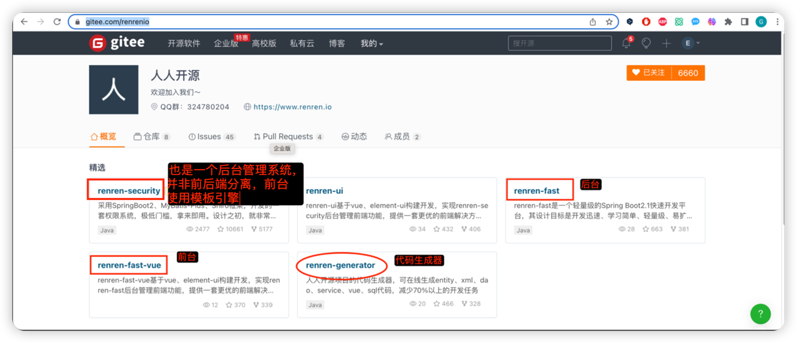

1. ###### 使用 gitee.com 上人人开源的 开箱即用的 后台管理项目来做

https://gitee.com/renrenio

我们要用到的是使用其中的：
renren-fast工程做后端
renre-fast-vue工程做前端
来做guilimall 的后台管理系统
使用方法:
1. 克隆下来去掉其中的 .git 目录，copy到 gulimall-do 目录
2. 在聚合项目的 pom.xml 的 modules 后面追加
`
   <modules>
   <module>gulimall-coupon</module>
   <module>gulimall-member</module>
   <module>gulimall-order</module>
   <module>gulimall-product</module>
   <module>gulimall-ware</module>
   <module>renren-fast</module>
`

3. 数据库准备
   1. 在 myqsl 数据库中创建数据库 gulimall_admin
   2. 用gulimall-do/renren-fast/db/mysql.sql
      中的建表语句在gulimall_admin数据库中创建表
4. 回到 IDEA 中阅读配置文件
   gulimall-do/renren-fast/src/main/resources/application.yml
5. 发现默认使用的配置文件是
   /Users/gcsp/IdeaProjects/gulimall-do/renren-fast/src/main/resources/application-dev.yml 
   修改文件的内容
6. 启动 renren-fast 工程，在浏览器中可以访问
   `
   http://localhost:8080/renren-fast/
   `

====分割线====

>未来将会使用
renren-generator来做代码生成

