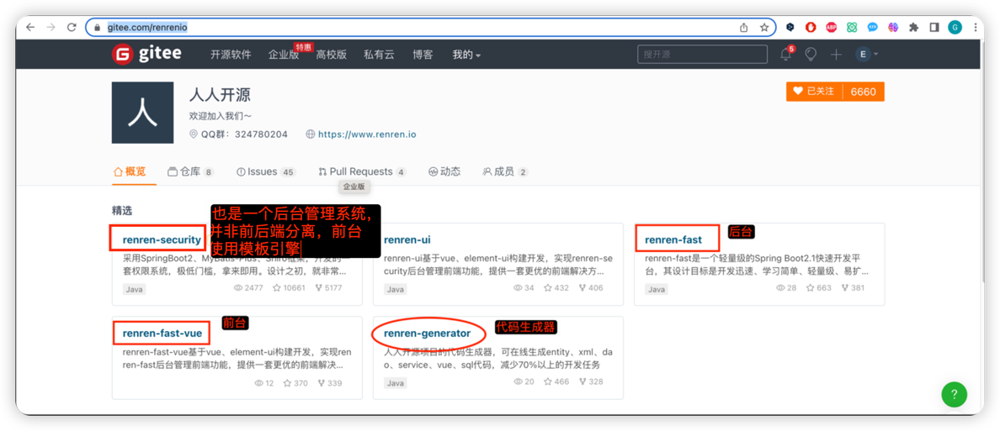
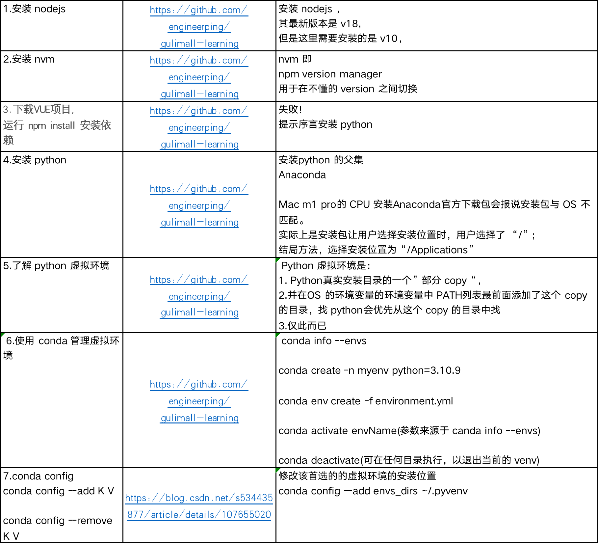

1. ###### 使用 gitee.com 上人人开源的 开箱即用的 后台管理项目来做

官网链接：
https://www.renren.io/

Gitee链接
https://gitee.com/renrenio

我们要用到的是使用其中的：
renren-fast工程做后端 https://gitee.com/engineerping/renren-fast
renre-fast-vue工程做前端 https://gitee.com/engineerping/renren-fast-vue
来做guilimall 的后台管理系统
使用方法:
1. 克隆下来去掉其中的 .git 目录，copy到 gulimall-do 目录
2. 在聚合项目的 pom.xml 的 modules 后面追加
`
   <modules>
   <module>gulimall-coupon</module>
   <module>gulimall-member</module>
   <module>gulimall-order</module>
   <module>gulimall-product</module>
   <module>gulimall-ware</module>
   <module>renren-fast</module>
`

**注意在这里查看 一个版本的springboot 应该使用哪个版本的 spring cloud
   https://spring.io/projects/spring-cloud**

3. 数据库准备
   1. 在 myqsl 数据库中创建数据库 gulimall_admin
   2. 用gulimall-do/renren-fast/db/mysql.sql
      中的建表语句在gulimall_admin数据库中创建表
4. 回到 IDEA 中阅读配置文件
   gulimall-do/renren-fast/src/main/resources/application.yml
5. 发现默认使用的配置文件是
   /Users/gcsp/IdeaProjects/gulimall-do/renren-fast/src/main/resources/application-dev.yml 
   修改文件的内容
6. 让 名为 mysql8 和 redis 的 docker 容器随着 Docker 守护进程的启动而自启动
   docker container update --restart=always mysql8；
   docker container update --restart=always redis；
最后，启动 renren-fast 工程，在浏览器中可以访问
   `
   http://localhost:8080/renren-fast/
   `
---
分割线
---

7. gulimall的后台管理项目的前端工程：
7.1. git clone https://gitee.com/engineerping/renren-fast-vue.git
7.2. 安装 nodejs 10.24.1。
     安装 nvm (Npm version manager)  
      7.2.1. `nvm ls-remote`   
            可用于查看 nvm 可以安装哪些版本的 nodejs, 
            但是网上有的文章中提及win 10 操作系统重 中使用 nvm list available 来实现相同的功能. 未曾在 win 10 中尝试,也可能是低版本的nvm命令 
            我错误地在 mac 系统中运行 `nvm list available`时 输出 N/A.特此记录
     电脑没有装 python 时执行 npm install 会报错
7.3. 安装 Anaconda 2023.03-1 （Python的超集）
更详细的过程见：

7.4. 新建一个 python 虚拟环境；并激活该虚拟环境

8. 在 renre-fast-vue工程 根目录下 执行npm install 成功
9. 执行 upm run dev 启动 renre-fast-vue 成功

---
分割线
---
10. gulimall 后台管理系统的前后端联调成功

>未来将会使用
renren-generator来根据书籍库中的表来生成 CRUD 代码

