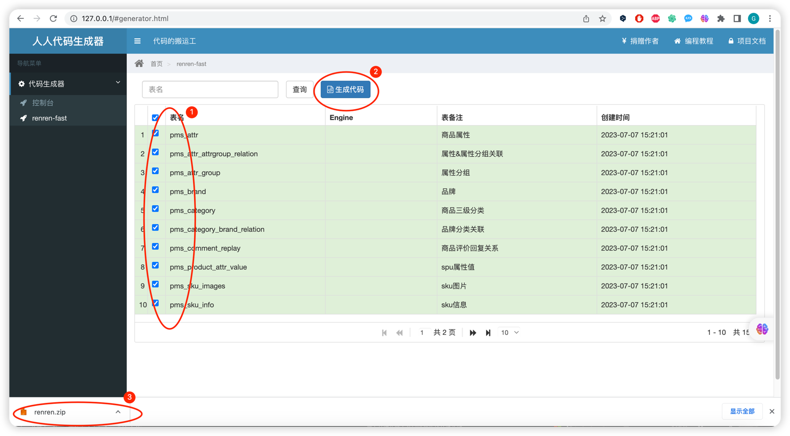

使用renren-generator 根据 gulimall-product对应的数据库中的表，
逆向工程生成 CRUD 代码，包括 
1. java code、
2. VUE codesql、
3. mybatis mapper.xml、
4. testing SQL
本页所写的笔记对应于视频
https://www.bilibili.com/video/BV1np4y1C7Yf/?p=17&vd_source=296138b5b3cfb93c548e36d81436eceb
详细步骤如下，也适用于未来写任何 CRUD 代码。

1. git clone https://gitee.com/engineerping/renren-generator.git
2. 根据renren-generator的使用文档，修改renren-generator工程的 
    application.properties
    application.yml
    配置文件。
3. 启动renren-generator，按如下操作生成

4. 将声所生成的代码复制到对应模块如gulimall-product的目标目录，
   （***注意选择与目标目录已存在的文件夹进行 merge, 而不是替换***）

5. 解决类不存在的问题：
    5.1. 新建 gulimall-common jar，在其中添加代码中所需的 dependencies; 
         然后让 gulimall工程的所有模块如gulimall-product，全都依赖该gulimall-common jar.
    5.2. 对于只存在在 renren-generator 工程中的类，可以直接复制到模块如gulimall-product中，如
         复制  renren-fast/src/main/java/io/renren/common/utils/PageUtils.java包中的所有类
         到 gulimall-common/src/main/java/com/atguigu/common/utils/目录
         
         复制 renren-fast/src/main/java/io/renren/common/utils/Query.java
         到 gulimall-common/src/main/java/com/atguigu/common/utils/目录
         
         复制 renren-fast/src/main/java/io/renren/common/utils/R.java
         到 gulimall-common/src/main/java/com/atguigu/common/utils/目录
    5.3. 不可避免地i，对于复制到gulimall-product中的类里面所缺少的类，要继续从renren-generator 工程中复制，如
         复制 renren-fast/src/main/java/io/renren/common/xss包中的所有类
         到 gulimall-common/src/main/java/com/atguigu/common/xss/SQLFilter.java

    5.4. 继续复制类
         复制 renren-fast/src/main/java/io/renren/common/utils/Constant.java包中的所有类
         到 gulimall-common/src/main/java/com/atguigu/common/utils/目录
    5.5. 至此 所有缺少的类都加进来了，除了 org.apache.shiro：shiro-core包中的 @RequiresPermissions注解
         然而这个不计划使用了，计划使用 ***spring security*** 代替 shiro
    5.3. 对于renren-generator生成的代码中缺少这个shiro包中的类的问题：
          <dependency>
            <groupId>org.apache.shiro</groupId>
            <artifactId>shiro-core</artifactId>
            <version>1.9.0</version>
          </dependency>
         由于计划使用 spring security 代替org.apache.shiro：shiro-core
         所以要把 renren-generator所生成的代码里的org.apache.shiro：shiro-core相关的个别内容删掉
         因此这里要做一件大事，好让将来生成的代码中不含org.apache.shiro：shiro-core包中不想要的内容：

         ***修改renren-generator所使用的模板***

         原模板是：
         renren-generator/src/main/resources/template/Controller.java.vm_original_backup
         修改后的模板是：
         renren-generator/src/main/resources/template/Controller.java.vm
                 
        
        