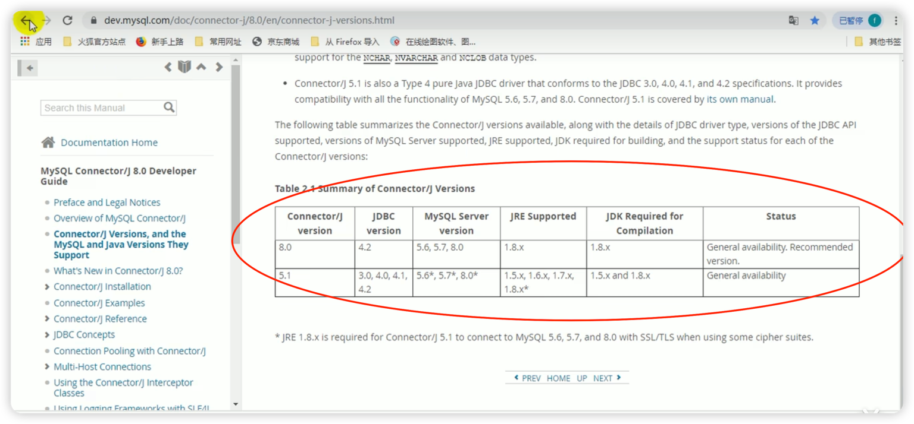

gulimall-product整合 mybatis-plus-完成最后CRUD的代码编写
在上一步使用renren-generator生成了CRUD代码，
但是如果要整合使用 mybatis-plus的话，还需要一些步骤：

1. 在 Springboot环境中导入mybatis-plus的依赖包（放在 gulimall-common.jar的 pom.xml文件中即可）
   <dependency>
    <groupId>com.baomidou</groupId>
    <artifactId>mybatis-plus-boot-starter</artifactId>
    <version>3.2.0</version>
   </dependency>

2. 配置：

    2.1. 配置数据源
        2.1.1 在 pom.xml中引入 Mysql 8 的驱动 （*** 放在 gulimall-common.jar的 pom.xml文件中即可 ***）
        2.1.2 在 application.yml中配置数据源相关信息
    2.2. 配置 MyBatisPlus
        2.2.1 *** 使用MyBatisPlus 的 @MapperScan注解 ***
              告诉 MyBatis 去哪些个包路径下去找 Mapper 接口
        2.2.2【*注意在使用了org.apache.ibatis.annotations.Mapper注解之后，就不需要 mapper.xml了
               所以本代码在gulimall-product/src/main/resources/mapper/product已经备份zip,所以mapper.xml可以删除了*】
              ~~ 在 application.yml 中通过
              mybatis-plus: mapper-locations：
              来指定 MyBatis 中表与对象的映射文件 mapper.xml
              的位置 ~~

---
以下是相关知识点，不是操作项
---
3. @org.apache.ibatis.annotations.Mapper注解是在org.mybatis:mybatis:3.4.0开始加入的一个注解
   使用该注解之后的MyBatis的Mapper接口，
   然后配合包org.apache.ibatis.annotations下面的 诸如@Select等应该标注在Mapper接口中的方法上的注解，在其中写上 SQL之后
   ***就不再需要编写 mapper.xml文件了***。

4. com.baomidou.mybatis-plus.core.mapper.BaseMapper是MyBatis-Plus框架提供的接口，
   它是一个通用的Mapper接口，提供了一些常用的数据库操作方法。
   BaseMapper接口中已经定义了一系列的增删改查方法，包括根据主键查询、插入、更新、删除等操作。
   通过继承BaseMapper接口，可以直接使用这些通用的数据库操作方法，无需编写具体的SQL语句。

5. 一个 Mybatis 的 Mapper 接口标注@Mapper注解同时实现 BaseMapper 接口是，
   两者可以结合使用，通过@Mapper注解标记Mapper接口，并继承BaseMapper接口，以实现更便捷的数据库操作。

6. MySql Diver version, Mysql version, Jdk version

