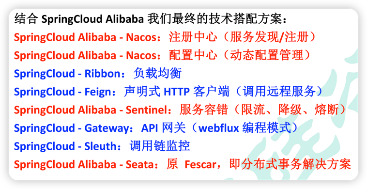
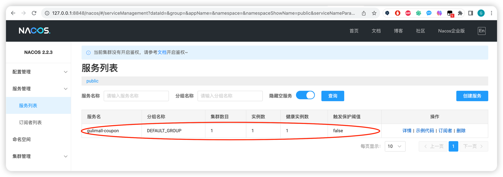

对应视频：
https://www.bilibili.com/video/BV1np4y1C7Yf?p=20
课件存放在本机 和 百度网盘：
本机路径为：
/Users/gcsp/Documents/BaiDuNetDisk/谷粒商城/课件和文档/基础篇/课件/02、SpringCloud组件.pdf

1. 为什么放弃 apache-spring-cloud,选择 apache-spring-clod-alibaba

SpringCloud 的几大痛点
SpringCloud 部分组件停止维护和更新， 给开发带来不便；
SpringCloud 部分环境搭建复杂， 没有完善的可视化界面， 我们需要大量的二次开发和定制
SpringCloud 配置复杂， 难以上手， 部分配置差别难以区分和合理应用

SpringCloud Alibaba 的优势：
阿里使用过的组件经历了考验， 性能强悍， 设计合理， 现在开源出来大家用
成套的产品搭配完善的可视化界面给开发运维带来极大的便利
搭建简单， 学习曲线低。

结合 SpringCloud Alibaba 我们最终的技术搭配方案：
SpringCloud Alibaba - Nacos： 注册中心（服务发现/注册）
SpringCloud Alibaba - Nacos： 配置中心（动态配置管理）
SpringCloud - Ribbon： 负载均衡
SpringCloud - Feign： 声明式 HTTP 客户端（调用远程服务）
SpringCloud Alibaba - Sentinel： 服务容错（限流、 降级、 熔断）
SpringCloud - Gateway： API 网关（webflux 编程模式）
SpringCloud - Sleuth： 调用链监控
SpringCloud Alibaba - Seata： 原 Fescar， 即分布式事务解决方案

2. SpringCloud Alibaba
1、 SpringCloud Alibaba 简介
1） 、 简介
Spring Cloud Alibaba 致力于提供微服务开发的一站式解决方案。 此项目包含开发分布式应用
微服务的必需组件， 方便开发者通过 Spring Cloud 编程模型轻松使用这些组件来开发分布
式应用服务。
依托 Spring Cloud Alibaba， 您只需要添加一些注解和少量配置， 就可以将 Spring Cloud 应用
接入阿里微服务解决方案， 通过阿里中间件来迅速搭建分布式应用系统。

https://spring.io/projects/spring-cloud-alibaba

https://github.com/alibaba/spring-cloud-alibaba

3.  版本选择

https://github.com/alibaba/spring-cloud-alibaba/wiki/%E7%89%88%E6%9C%AC%E8%AF%B4%E6%98%8E   

   由于 Spring Boot 1 和 Spring Boot 2 在 Actuator 模块的接口和注解有很大的变更， 且
   spring-cloud-commons 从 1.x.x 版本升级到 2.0.0 版本也有较大的变更， 因此我们采取跟
   SpringBoot 版本号一致的版本:
    1.5.x 版本适用于 Spring Boot 1.5.x
    2.0.x 版本适用于 Spring Boot 2.0.x
    2.1.x 版本适用于 Spring Boot 2.1.x

4. 开始使用
   https://github.com/alibaba/spring-cloud-alibaba/blob/2022.x/README-zh.md
   
   在 gulimall-common 的 pom.xml 中加入如下节点
   `
   <dependencyManagement>
   <dependencies>
   <dependency>
   <groupId>com.alibaba.cloud</groupId>
   <artifactId>spring-cloud-alibaba-dependencies</artifactId>
   <version>2.1.0.RELEASE</version>
   <type>pom</type>
   <scope>import</scope>
   </dependency>
   </dependencies>
   </dependencyManagement>
   `
5. 使用 Nacos 作为配置中心：
   官方 Demo
   https://github.com/alibaba/spring-cloud-alibaba/blob/2022.x/README-zh.md#%E6%BC%94%E7%A4%BA-demo
   官方给的 Nacos 组件的 Guide
   https://github.com/alibaba/spring-cloud-alibaba/blob/2022.x/spring-cloud-alibaba-examples/nacos-example/nacos-discovery-example/readme-zh.md
   
   Mac OS 下载 nacos-server-$version.zip 包。
   https://github.com/alibaba/nacos/releases
   
   解压后直接执行
   nacos/bin/startup.sh
   只要 8848 端口没有被占用，就嫩刚启动成功 nacos server

   最后，在浏览器输入
   http://localhost:8848/nacos
   进入 Nacos 的 UI

   假如发现 此时服务管理 -> 服务列表 职中应该是空的，需要在 application.yml中指定服务名
   `
   spring.application.name=service-provider
   server.port=7000
   `
   
6. 成功
   

7. 知识点：
   以前使用 Eureka 的时候，Eureka 的 启动类上需要标注
   @EnableDiscoveryClient注解，而 Nacos 为什么不需要？

   --> 那是因为@SpringBootApplication里面有个@EnableAutoConfiguration
   里面有个AutoConfigurationImportSelector会去classpth中找到spring.factory
   获取其中key为EnableAutoConfiguration的键值对的值
   而nacos的jar中配置了这个值，所以就不用家EnableDiscoverClient了

