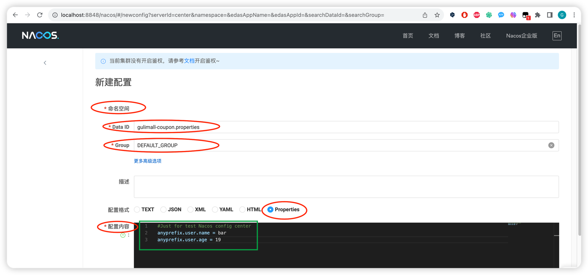
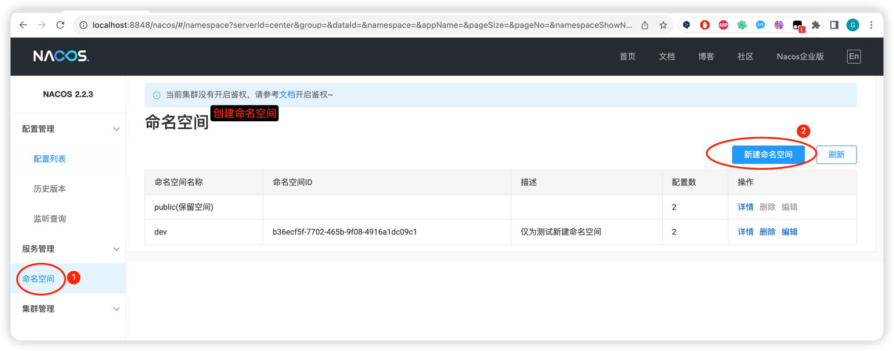

使用 Nacos 作为配置中心：
   (本 item 1的内容 参考 
   1.1.课件视频，链接如下：
   https://www.bilibili.com/video/BV1np4y1C7Yf?p=24
   课件文档本机地址：
   /Users/gcsp/Documents/BaiDuNetDisk/谷粒商城/课件和文档/基础篇/课件/02、SpringCloud组件.pdf

   1.2. 最新内容见官网说明
   https://github.com/alibaba/spring-cloud-alibaba/blob/2022.x/spring-cloud-alibaba-examples/nacos-example/nacos-config-example/readme-zh.md
   )
 如何接入： 

SpringCloud Alibaba-Nacos[作为配置中心]
1. pom.xml 引入 Nacos Config Starter。
<dependency>
<groupId>com.alibaba.cloud</groupId>
<artifactId>spring-cloud-starter-alibaba-nacos-config</artifactId>
</dependency>
2. 在 应 用 的 /src/main/resources/bootstrap.properties 配
置文件中配置 Nacos Config 元数据
spring.application.name=nacos-config-example
spring.cloud.nacos.config.server-addr=127.0.0.1:8848
主要配置应用名和配置中心地址
3. 在 nacos 中添加配置

***注意：在使用了 Nacos 作配置中心的 springboot 工程的启动日志中有如下输出：
PropertySourceBootstrapConfiguration : Located property source: CompositePropertySource {name='NACOS', propertySources=[NacosPropertySource {name='gulimall-coupon.properties,DEFAULT_GROUP'}, NacosPropertySource {name='gulimall-coupon,DEFAULT_GROUP'}]}
其中有：
[NacosPropertySource {name='gulimall-coupon.properties,DEFAULT_GROUP'}, NacosPropertySource {name='gulimall-coupon,DEFAULT_GROUP'}]}
就是指 Nacos 配置中心的缺省设置***
在 Nacos UI 上进行配置-Helloworld, 具体配置内容见下图

基于以上信息，所以在 nacos 中创建一个 应用名.properties （亦即 ${spring.application.name}.properties）配置文件并编写配置
Nacos Config 数据结构
Nacos Config 主要通过 dataId 和 group 来唯一确定一条配置。
Nacos Client 从 Nacos Server 端获取数据时， 调用的是此接口 ConfigService.getConfig(StringdataId, String group, long timeoutMs)。
Spring Cloud 应用获取数据
dataID：
在 Nacos Config Starter 中， dataId 的拼接格式如下
 ${prefix} - ${spring.profiles.active} . ${file-extension} prefix 默认为 spring.application.name
的值， 也可以通过配置项 spring.cloud.nacos.config.prefix 来配置。
 spring.profiles.active 即为当前环境对应的 profile
注意， 当 activeprofile 为空时， 对应的连接符 - 也将不存在， dataId 的拼接格式变成
${prefix}.${file-extension}
file-extension 为配置内容的数据格式， 可以通过配置项
spring.cloud.nacos.config.file-extension 来配置。 目前只支持 properties 类型。
Group：
Group 默认为 DEFAULT_GROUP， 可以通过 spring.cloud.nacos.config.group 配置。
4. ***在字段所在的类上标注@RefreshScope，在字段上使用@Value注解【~~~注意不是标注在 springboot 启动类上~~~】***
完成上述两步后， 应用会从 Nacos Config 中获取相应的配置， 并添加在 Spring Environment
的 PropertySources 中 。 这 里 我 们 使 用 @Value 注 解 来 将 对 应 的 配 置 注 入 到
SampleController 的 userName 和 age 字段， 并添加 @RefreshScope 打开动态刷新功能
`
@RefreshScope
class SampleController {
@Value("${user.name}")
String userName;
@Value("${user.age}")
int age;
} 
`

5. *** 重启 Nacos server ***
   `sh shutdown.sh`
   `sh startup.sh -m standalone` # 如果不带 standalone 参数，则启动的是 cluster,且启动失败
---
6. Nacos 配置进阶
---
1. 核心概念

命名空间：
用于进行租户粒度的配置隔离。 不同的命名空间下， 可以存在相同的 Group 或 Data ID 的
配置。 Namespace 的常用场景之一是不同环境的配置的区分隔离， 例如开发测试环境和生
产环境的资源（如配置、 服务） 隔离等。
配置集：一组相关或者不相关的配置项的集合称为配置集。 在系统中， 一个配置文件通常就是一个配
置集， 包含了系统各个方面的配置。 例如， 一个配置集可能包含了数据源、 线程池、 日志级
别等配置项。
配置集 ID：
Nacos 中的某个配置集的 ID。 配置集 ID 是组织划分配置的维度之一。 Data ID 通常用于组
织划分系统的配置集。 一个系统或者应用可以包含多个配置集， 每个配置集都可以被一个有
意义的名称标识。 Data ID 通常采用类 Java 包（ 如 com.taobao.tc.refund.log.level） 的命名
规则保证全局唯一性。 此命名规则非强制。
配置分组：
Nacos 中的一组配置集， 是组织配置的维度之一。 通过一个有意义的字符串（ 如 Buy 或
Trade ） 对配置集进行分组， 从而区分 Data ID 相同的配置集。 当您在 Nacos 上创建一个
配置时， 如果未填写配置分组的名称， 则配置分组的名称默认采用 DEFAULT_GROUP 。 配置
分组的常见场景： 不同的应用或组件使用了相同的配置类型， 如 database_url 配置和
MQ_topic 配置。
2. 原理
自动注入：
NacosConfigStarter 实现了 org.springframework.cloud.bootstrap.config.PropertySourceLocator
接口， 并将优先级设置成了最高。
在 Spring Cloud 应用启动阶段， 会主动从 Nacos Server 端获取对应的数据， 并将获取到的
数据转换成 PropertySource 且注入到 Environment 的 PropertySources 属性中， 所以使用
@Value 注解也能直接获取 Nacos Server 端配置的内容。
动态刷新：
Nacos Config Starter 默认为所有获取数据成功的 Nacos 的配置项添加了监听功能， 在监听
到服务端配置发生变化时会实时触发
org.springframework.cloud.context.refresh.ContextRefresher 的 refresh 方法 。
如果需要对 Bean 进行动态刷新， 请参照 Spring 和 Spring Cloud 规范。 推荐给类添加
@RefreshScope 或 @ConfigurationProperties 注解，
3. 加载多配置文件
spring.cloud.nacos.config.server-addr=127.0.0.1:8848
spring.cloud.nacos.config.namespace=31098de9-fa28-41c9-b0bd-c754ce319ed4
spring.cloud.nacos.config.ext-config[0].data-id=gulimall-datasource.yml
spring.cloud.nacos.config.ext-config[0].refresh=false
spring.cloud.nacos.config.ext-config[0].group=dev
4. namespace 与 group 最佳实践
每个微服务创建自己的 namespace 进行隔离， group 来区分 dev， beta， prod 等环境

3. 关于 Nacos 作为配置中心，具体在 UI 上怎么操作，以及在配置文件中怎么写，本笔记中就不详细写了，

   可以看课件视频，链接如下：
   https://www.bilibili.com/video/BV1np4y1C7Yf?p=24
   课件文档本机地址：
   /Users/gcsp/Documents/BaiDuNetDisk/谷粒商城/课件和文档/基础篇/课件/02、SpringCloud组件.pdf

   官方中文指导文档写得非常详细：
   https://github.com/alibaba/spring-cloud-alibaba/blob/2022.x/spring-cloud-alibaba-examples/nacos-example/nacos-config-example/readme-zh.md
   关于 Nacos 更多的使用细节，可以阅读 Nacos 官方中文文档
   https://nacos.io/zh-cn/docs/what-is-nacos.html

5. 小知识点
如果应用程序读取到的一直是本地配置而获取不到 Nacos 配置中心的配置，就看这里 -->
添加依赖：由于SpringCloud Feign在Hoxton.M2 RELEASED版本之后不再使用Ribbon而是使用spring-cloud-loadbalancer