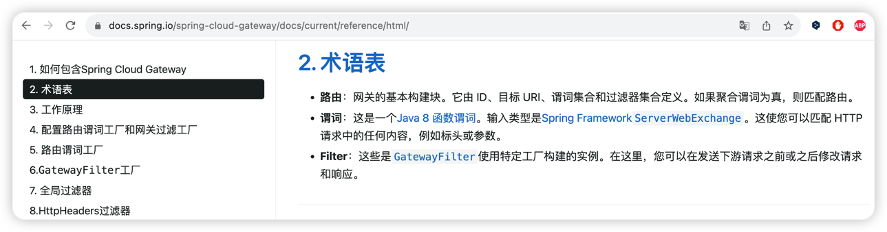
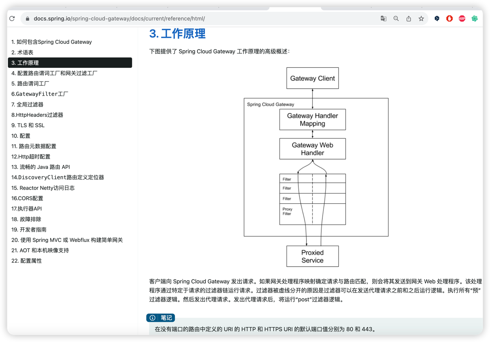
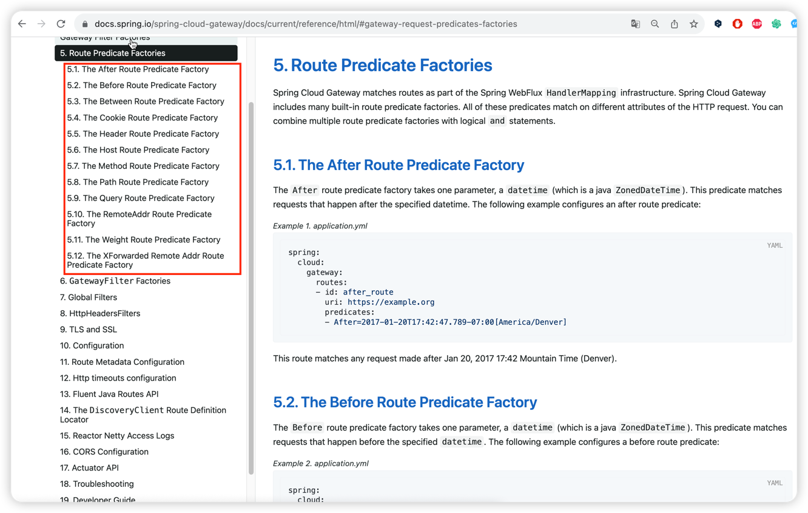
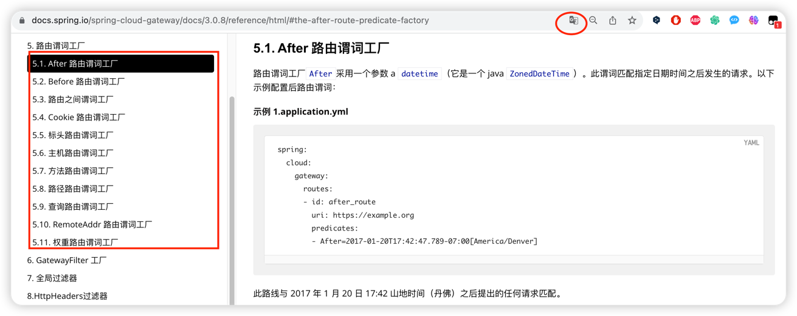
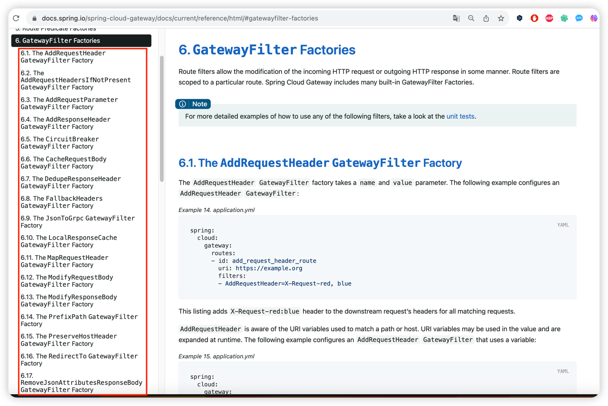
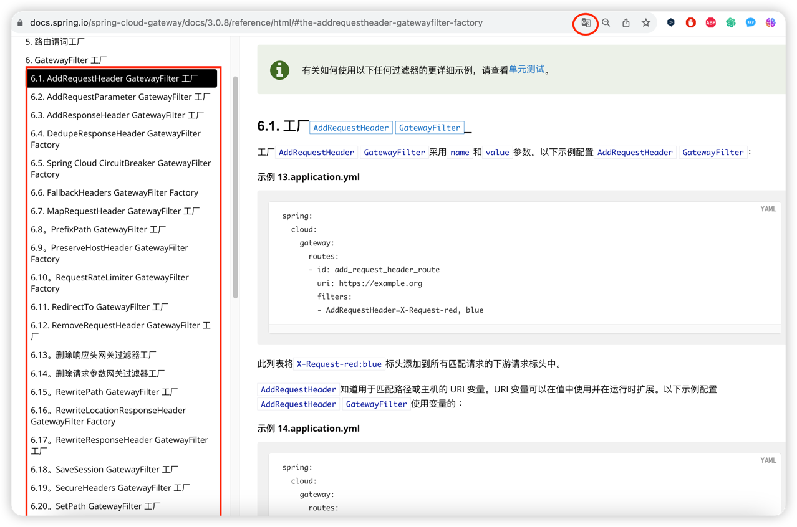

zuul 已经落后，zuul2 性能不及 spring-cloud-gateway.  
1. 使用 spring cloud gateway 作为网关：  
   概览  
   https://spring.io/projects/spring-cloud-gateway  
   官方指导文档:  
   https://docs.spring.io/spring-cloud-gateway/docs/3.1.8/reference/html/  

   1.1. nginx 与 gateway 的责任分工, 在本套视频谷粒商城 第 136 节有讲.
    https://www.bilibili.com/video/BV1np4y1C7Yf?p=136  

2. 工作过程概述：

   2.1. 客户端向 Spring Cloud Gateway 发出请求  

   2.2. Spring Cloud Gateway的application.yml配置文件的  
        spring:  
          cloud:  
            gateway:  
              routes: 节点的值是 List （即可以在 yml 文件中 用 "-" 来表示 List 中的一个元素，我们姑且称之为单数 route）;  
   2.3. 一个 route 包含 4 个内容：  
        1. id (这个只是唯一标识，不重要)  
        2. predicates 断言，如果断言结果为 true, 则执行 当前的 filter.(predicates 的值是一个 List, 所以其实可以定义多个predicate)  
        3. filter 过滤器，被断言为 true 的请求，将经过过滤器进行处理（修改）.(filter 的值是一个 List, 所以其实可以定义多个filter，形成过滤器链)  
        4. uri 目标 uri, 请求最终将会被发送给这个目标 uri 进行处理,(需要注意的是目标 uri 处理之后所返回的内容也要经过 filter 处理)。  
        

   
   

   ---
   分割线
   ---
 （
   * 老师简述：   
   4.1. 客户端向 Spring Cloud Gateway 发出请求->  
   4.2. 每个 route 使用 Predicate（断言）来判定该请求与配置文件中的哪个 Route（路由规则） 相匹配->  
   4.3. 若匹配成功就按该路由规则将请求路由到指定地方，期间要经过一系列 Filter（过滤器）即 Filter Chain (过滤器链)  

   * 官方概述：  
   客户端向 Spring Cloud Gateway 发出请求。  
   如果网关处理程序映射确定请求与路由匹配，则会将其发送到网关 Web 处理程序。该处理程序通过特定于请求的过滤器链运行请求。  
   过滤器被虚线分开的原因是过滤器可以在发送代理请求之前和之后运行逻辑。执行所有“预”过滤器逻辑。然后发出代理请求。发出代理请求后，将运行“post”过滤器逻辑。 
   ）

3. 实践
   课件视频：
   https://www.bilibili.com/video/BV1np4y1C7Yf?p=27
   课件所参考的官方文档：
   https://docs.spring.io/spring-cloud-gateway/docs/3.0.8/reference/html/#the-query-route-predicate-factory

4. 学习点：

   3.1. 如何定义路由规则 Route

   3.2. Predicate （断言）是如何判定 True/False，我们应当如何配置；有哪些断言种类
         https://docs.spring.io/spring-cloud-gateway/docs/3.0.8/reference/html/#gateway-request-predicates-factories
   
   

   3.3. 有哪些 Filter 可以用
         https://docs.spring.io/spring-cloud-gateway/docs/3.0.8/reference/html/#gatewayfilter-factories
   
   

   

